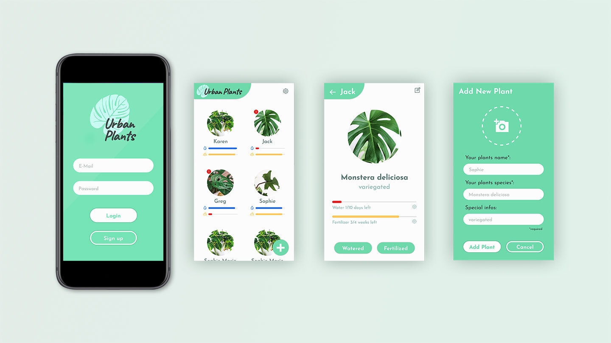

# UrbanPlants

UrbanPlants is the easy way to organize your indoor plants... Just add them to your plant list, set your care interval and get reminded if you have to water or fertilize them.
  

  

_Installation instructions are in the frontend and the backend folder_
  

### Tech Stack (so far)

- JS
- React
- Styled-Components
- Prop-Types
- Styleguidist
- React Testing Library
- PHP
- Symfony